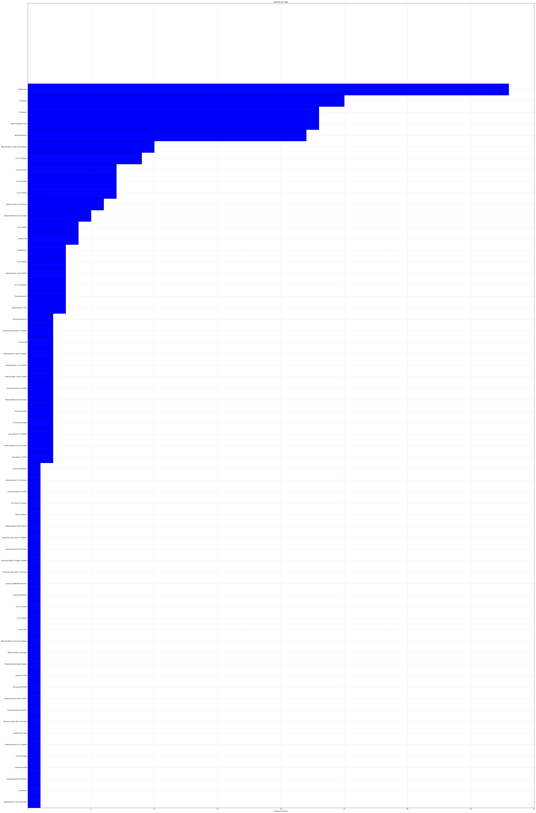

# An Amphours Postmortem

I helped build the backend for Amphours, the first battery benchmark tailored towards real world use. 

A few days ago my partner [Ming](https://github.com/ming08108?tab=overview&from=2016-08-01&to=2016-08-31&utf8=%E2%9C%93) finally decided to not renew the .xyz domain (Send all hate mail to him). 


But before I say goodbye, I'd like to showcase the data we collected over the course of ~1 year before we all switched to iOS. 


# Grabbing the Data


Amphours was built with 2 collections in MongoDB - one for unique devices, and one for statistics read-outs. 

First, lets grab some data from both MongoDB instances. 


`$ mongoexport -h secret_DB.db_host.com:231337 -d amphours -c statistics -u username -p pass -o statistics.json --jsonArray`

=> 63 records

`$ mongoexport -h secret_DB.db_host.com:231337 -d amphours -c devices -u username -p pass -o devices.json --jsonArray`

=> 54881 records

Let's load it up. 


```python
import json 
from pprint import pprint

with open('devices.json') as devices_raw: 
    devices = json.load(devices_raw)

with open('statistics.json') as statistics_raw: 
    statistics = json.load(statistics_raw)
    
# Print out the last few
print "Devices"
pprint(devices[:3]) 

print "Statistics"
pprint(statistics[:3])

```

    Devices
    [{u'_id': {u'$oid': u'57649f238b09bce65c43c7bb'},
      u'count': 38,
      u'friendlyname': u'Asus Nexus 7 (2013)',
      u'name': u'asus Nexus 7',
      u'rank': 1,
      u'sot': {u'$numberLong': u'41976548'},
      u'standby': {u'$numberLong': u'154386092'},
      u'uniquedevices': 2},
     {u'_id': {u'$oid': u'57649f238b09bce65c43c7bc'},
      u'count': 75,
      u'friendlyname': u'Motorola Moto X 2013 (Europe)',
      u'name': u'motorola XT1052',
      u'rank': 2,
      u'sot': {u'$numberLong': u'36933090'},
      u'standby': {u'$numberLong': u'63887738'},
      u'uniquedevices': 2},
     {u'_id': {u'$oid': u'57649f238b09bce65c43c7bd'},
      u'count': 661,
      u'friendlyname': u'Motorola Moto X Style (Pure Edition)',
      u'name': u'motorola XT1575',
      u'rank': 3,
      u'sot': {u'$numberLong': u'32610548'},
      u'standby': {u'$numberLong': u'39241215'},
      u'uniquedevices': 10}]
    Statistics
    [{u'_id': {u'$oid': u'55ebccdfb94be457b7f38c2c'},
      u'date': {u'$numberLong': u'1441516699'},
      u'device': u'LGE LG-H811',
      u'friendlyname': u'LGE LG-H811',
      u'sot': {u'$numberLong': u'284368'},
      u'total': {u'$numberLong': u'3718542'},
      u'used': 3,
      u'uuid': u'bc39765e-005d-4ecc-beb0-8eeb46e5edd5',
      u'version': 22},
     {u'_id': {u'$oid': u'55ec6235b94be457b7f38c2d'},
      u'date': {u'$numberLong': u'1441554929'},
      u'device': u'LGE LG-H811',
      u'friendlyname': u'LGE LG-H811',
      u'sot': {u'$numberLong': u'1832653'},
      u'total': {u'$numberLong': u'38208845'},
      u'used': 37,
      u'uuid': u'bc39765e-005d-4ecc-beb0-8eeb46e5edd5',
      u'version': 22},
     {u'_id': {u'$oid': u'55ec77c7b94be457b7f38c2e'},
      u'date': {u'$numberLong': u'1441560451'},
      u'device': u'LGE LG-H811',
      u'friendlyname': u'LGE LG-H811',
      u'sot': {u'$numberLong': u'197945'},
      u'total': {u'$numberLong': u'1963997'},
      u'used': 4,
      u'uuid': u'bc39765e-005d-4ecc-beb0-8eeb46e5edd5',
      u'version': 22}]
    

# Devices

From the start, our strategy for Amphours was to start small on several different Android phone specific subreddits.  


```python
print len(devices)
```

    63
    

We got 63 different types! Yowza. Didn't expect that. 

(Though in fairness, most major manufacturers come up as different units because of region locking and carriers)

Here's the distribution of users with these devices in an inappropriately large bar graph:


```python
%matplotlib inline

from pylab import *

# Get # of uniques per device 

sorted_devices = sorted(devices, key=lambda device: device['uniquedevices'])

names = [device['friendlyname'] for device in sorted_devices]
uniques = [device['uniquedevices'] for device in sorted_devices]

figure(figsize=(len(names), 100))
pos = arange(len(names))+  0.5    # the bar centers on the y axis

barh(pos, uniques, align='center', height=1)
yticks(pos, tuple(names))
xlabel('Number of Devices')
title('Devices by Type')
grid(True)


show()
```





Our efforts on /r/OnePlus were far and away the most successful, though more with the PlusOne than the PlusTwo. 


The most surprising result is the Droid Turbo - we don't even know anybody with a Droid Turbo. 


# Statistics 

Next lets dive into the statistics. 

Who has the most battery life?


```python
# Lets find the total first 
sorted_statistics_total = sorted(statistics, key=lambda stat: stat['total'])

pprint(sorted_statistics_total[:1])


```

    [{u'_id': {u'$oid': u'56192caa4eaa1c0dbed8c144'},
      u'date': {u'$numberLong': u'1444490308'},
      u'device': u'samsung SAMSUNG-SM-N910A',
      u'friendlyname': u'Samsung Galaxy Note4',
      u'sot': {u'$numberLong': u'-429355737'},
      u'total': {u'$numberLong': u'-428735446'},
      u'used': 9,
      u'uuid': u'de702b52-b09a-407e-bba1-c79535f8dbe0',
      u'version': 21}]
    


```python

```
